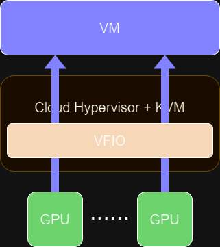

.. meta::
  :description: MI300 configuration for pass-through use with Cloud Hypervisor
  :keywords: MI300, Cloud Hypervisor, Virtual Function I/O, VFIO, AMD, ROCm

.. _mi300-passthru:

*************************************************************************************
Configuring MI300 for pass-through on Cloud Hypervisor
*************************************************************************************

Virtual Function I/O (VFIO) is an innovative user-level driver framework for Linux. By providing direct device access to user space within a secure memory environment protected by IOMMU, the VFIO driver enables Virtual Machine (VM) guests to interact directly with hardware devices on the VM host server. 

For MI300 GPUs pass-through on the Cloud Hypervisor uses VFIO as a base solution, as shown in the following figure. However, this requires configuring the host system and the device for access through the VFIO driver, as described here. 

Host SW setting - Linux kernel setup
====================================

To assign a device such as an MI300 to a Cloud Hypervisor guest, the device needs to be managed by a VFIO kernel driver. However, by default, the host device binds to its native driver, which is not a VFIO driver. Therefore, you must unbind the device from the native driver by blocking the ``amdgpu`` driver on Linux boot up, before it can be passed to the cloud manager to assign it to the guest.

Additionally, to enable CPU mode changes and run specific processor instructions in a VM, you must enable write permission of the model-specific registers (MSRs). To enable PCI pass-through functionality, you must enable virtualization extensions and IOMMU. All of the needed configurations can be set in ``/etc/default/grub`` and then applied to the OS boot grub configuration. To enable virtualization extensions, you must set up the System BIOS with the following settings:

* SR-IOV support (Advanced > PCI Subsystem Settings page) = Enable
* Above 4G Decoding (Advanced > PCI Subsystem Settings page) = Enable
* ARI Support (Platform configuration > Miscellaneous Configuration page) = Enable
* Intel VT for Directed I/O (Socket configuration > IIO Configuration > VT-d) = Enable
* Platform configuration > Runtime Error Logging > System Errors = Disable

The changes to ``/etc/default/grub`` are shown in the following code with the required Linux kernel parameters highlighted:

.. code-block:: shell

    $ sudo vi /etc/default/grub

    GRUB_TIMEOUT=1
    GRUB_DISTRIBUTOR="$(sed 's, release .*$,,g' /etc/system-release)"
    GRUB_DEFAULT=saved
    GRUB_DISABLE_SUBMENU=true
    GRUB_TERMINAL_OUTPUT="console"
    GRUB_CMDLINE_LINUX=""
    GRUB_DISABLE_RECOVERY="true"
    GRUB_ENABLE_BLSCFG=false
    GRUB_CMDLINE_LINUX_DEFAULT="panic=0 nowatchdog msr.allow_writes=on nokaslr pci=realloc=off modprobe.blacklist=amdgpu modprobe.blacklist=mlx5_core console=tty0 console=ttyS0,115200n8 rd.auto=1 intel_iommu=on amd_iommu=0 iommu=pt"
    # Curtin disable grub os prober that might find other OS installs.
    GRUB_DISABLE_OS_PROBER="true"
    # Curtin configured GRUB_TERMINAL value
    GRUB_TERMINAL="console"

Apply the ``/etc/default/grub`` updates for the appropriate OS as shown below:

.. tab:: 

.. tab-set::
    .. tab-item:: Ubuntu
        :sync: Ubuntu

        .. code-block:: shell

            $ sudo update-grub
            $ sudo update-grub2
            $ sudo reboot

    .. tab-item:: Rocky Linux
        :sync: RockyLinux

        .. code-block:: shell

            $ sudo grub2-mkconfig -o /boot/efi/EFI/rocky/grub.cfg 
            $ sudo grub2-mkconfig -o /boot/grub2/grub.cfg
            $ sudo reboot

        The ``grubby`` utility can also be used to update the kernel command line arguments:
        
        ``$ grubby --update-kernel=ALL --args="<NEW_PARAMETER>"``

Known issues
------------

On some systems, you might observe memory limit errors when mapping DMA. For example,
when starting a VM you may see ``Error booting VM: VmBoot(DeviceManager(VfioDmaMap(IommuDmaMap(Error(12)))))`` and the message ``vfio_pin_pages_remote: RLIMIT_MEMLOCK (8388608) exceeded appears`` in dmesg. To resolve the error, increase the memory limit to unlimited.

You might also notice that it runs into the Linux file descriptors limit: ``Os { code: 24, kind: Uncategorized, message: "Too many open files" }`` appears when starting a VM. 
You can increase the Linux file descriptors from the default value of 1024 to avoid the issue.

To resolve these issues edit the ``/etc/security/limits.conf`` file to increase the memory limit and Linux file descriptors, as shown in the following example:

.. code-block:: shell

    $ sudo vi /etc/security/limits.conf
        @user           soft    memlock         unlimited
        @user           hard    memlock         unlimited
        *               soft    nofile          4096
        *               hard    nofile          8192
    
    $ sudo reboot

VM Hard disk image setup
========================

Setting up the VM hard disk image is a one-time task. After you have completed the VM hard disk image setup using the following steps you won't need to set up the VM hard disk image again.

1.	Install hard disk image convert tools:

    To enlarge and convert a hard disk image from ``qcow2`` to ``raw`` format, you need to use the ``qemu-img`` tool. Creating a cloud-init hard disk image also requires ``mtools``. Command to install ``qemu-img`` and ``mtools``:

    .. code-block:: shell

        $ sudo apt-get -y install qemu-img mtools  # For Ubuntu
        $ sudo dnf -y install qemu-img mtools      # For Rocky Linux

2.	Download the Cloud Hypervisor initial files:

    To setup the cloud-hypervisor VM, you need hypervisor related files such as applications, cloud-hypervisor customized kernel files hypervisor-fw, and pre-installed Ubuntu hard disk images. 
    
    For more information, see https://github.com/cloud-hypervisor/cloud-hypervisor. Features include CPU, memory and device hotplug, support for running Windows and Linux guests, device offload with vhost-user and a minimal compact footprint. Cloud Hypervisor is written in Rust and has a strong focus on security. 

    The commands to download the relevant files are shown in the following table.

    .. csv-table::
        :widths: 30, 70
        :header: "File", "Command"

        hypervisor-fw, "$ wget https://github.com/cloud-hypervisor/rust-hypervisor-firmware/releases/download/0.4.2/hypervisor-fw"
        cloud-hypervisor,	"$ wget https://github.com/cloud-hypervisor/cloud-hypervisor/releases/download/v38.0/cloud-hypervisor"
        jammy-server-cloudimg-amd64.img, "$ wget https://cloud-images.ubuntu.com/jammy/current/jammy-server-cloudimg-amd64.img"
        user-data,	"$ wget https://raw.githubusercontent.com/cloud-hypervisor/cloud-hypervisor/main/test_data/cloud-init/ubuntu/local/user-data"
        meta-data,	"$ wget https://raw.githubusercontent.com/cloud-hypervisor/cloud-hypervisor/main/test_data/cloud-init/ubuntu/local/meta-data"
        Network-config,	"$ wget https://raw.githubusercontent.com/cloud-hypervisor/cloud-hypervisor/main/test_data/cloud-init/ubuntu/local/network-config"

3.	Enlarge and convert the VM hard disk image to RAW format:

    The pre-installed Ubuntu hard disk image capacity is small and doesn't have enough space to host the ROCm software stack. The Ubuntu hard disk image capacity needs to be expanded. 
    The Cloud Hypervisor doesn't support ``qcow2`` format hard disk image. You must convert it to RAW format.

    The commands to enlarge and convert the format of the hard disk image are shown below.

    .. code-block:: shell

        $ qemu-img create -b jammy-server-cloudimg-amd64.img -F qcow2 -f qcow2 jammy-server-cloudimg-amd64.qcow2 200G
        $ qemu-img convert -p -f qcow2 -O raw jammy-server-cloudimg-amd64.qcow2 jammy-server-cloudimg-amd64.raw

4.	Create a ``cloud-init`` hard disk image:

    The pre-installed Ubuntu hard disk image does not come with a default hostname, username, and password, so it needs to use a ``cloud-init`` disk image to set up the hostname, username, and password on the first boot.

    The host name can be changed in meta-data file (default hostname is ``cloud``), and the username/password can be changed in file user-data (default username/password is ``cloud``/``cloud123``). 

    The commands to create a ``cloud-init`` disk image are shown in the following example, which creates a VM image ``unbuntu-cloudinit.img`` used for initial setup. 

    .. code-block:: shell

        $ mkdosfs -n CIDATA -C /tmp/ubuntu-cloudinit.img 8192
        $ mcopy -oi /tmp/ubuntu-cloudinit.img -s user-data ::
        $ mcopy -oi /tmp/ubuntu-cloudinit.img -s meta-data ::
        $ mcopy -oi /tmp/ubuntu-cloudinit.img -s network-config ::

5.	Start the VM for the first time:

    Start your VM for the first time with the following commands:

    .. code-block:: shell

        $ HOST_INTERFACE=$(ip route get $(ip route | awk '/default/ {print $3}') | awk '{print $3}')
        $ sudo ip link add link $HOST_INTERFACE name macvtap0 type macvtap
        $ sudo ip link set macvtap0 address 00:02:03:04:05:06 up
        $ sudo ip link show macvtap0
        $ TAP0_INDEX=$(< /sys/class/net/macvtap0/ifindex)
        $ TAP0_DEVICE="/dev/tap$TAP0_INDEX"
        $ sudo chown "$UID.$UID" "$TAP0_DEVICE"

        $ ./cloud-hypervisor --kernel ./hypervisor-fw --disk path=jammy-server-cloudimg-amd64.raw path=/tmp/ubuntu-cloudinit.img --console off --serial tty --cpus boot=4 --memory size=102400M --net fd=173,mac=00:02:03:04:05:06 173<>$"$TAP0_DEVICE"

    .. note::
        Some parameters in the command are only used when first starting the VM. These parameters will be changed in the following sections.

6.	Setup the network in VM:

    After the VM is started, log in to the VM and configure the Ethernet. You'll use a NIC to communicate with the host, configured with IP address ``192.168.11.2``. The other NICs are used for bridging to the host network, configured as DHCP.

    With Ubuntu, network configuration is performed via ``netplan``.

    .. code-block:: shell

        $ sudo vi /etc/netplan/50-cloud-init.yaml
            network:
            version: 2
            ethernets:
                seth0:
                match:
                    macaddress: "12:34:56:78:90:ab"
                dhcp4: no
                addresses: [192.168.11.2/24]
                set-name: seth0
                zz-all-en:
                match:
                    name: "en*"
                dhcp4: true
                zz-all-eth:
                match:
                    name: "eth*"
                dhcp4: true

        $ sudo netplan apply

7.	Disable auto-loading ``amdgpu`` in VM:

    You generally don't want the VM to automatically load the amdgpu driver. So add ``amdgpu`` to ``modprobe`` blacklist.

    .. code-block:: shell

        $ sudo vi /etc/default/grub
            GRUB_CMDLINE_LINUX="modprobe.blacklist=amdgpu"
        $ sudo update-grub

    .. tip::
        You can skip this if you need the VM to load ``amdgpu`` automatically.

8.	Shutdown the VM:

    After you have completed the preceding steps to configure the VM hard disk image, you must shut down the VM.

    .. code-block:: shell

        $ sudo shutdown now

9.	Remove non-used files:

    Because VM hard disk image setup is a one-time job, some files are not required after the setup job is completed, and you can safely delete them. 
    
    .. code-block:: shell

        $ sudo rm -f /tmp/ubuntu-cloudinit.img jammy-server-cloudimg-amd64.img user-data meta-data network-config
        $ tar cvjf jammy-server-cloudimg-amd64.raw.tar.bz2 jammy-server-cloudimg-amd64.raw

    .. tip:: 
        Consider backing up the new VM hard disk image so that you can restore it if needed without reconfiguring the VM hard disk image again.

Start the VM
============

After configuring the VM hard disk image as previously described, start the VM with the following script. The command contains some bash variables. The following sections describe how to set up the configuration and set the values of bash variables.

.. code-block:: shell

    $ ./cloud-hypervisor --kernel ./hypervisor-fw --disk path=jammy-server-cloudimg-amd64.raw --console off --serial tty --log-file /tmp/cloud-hypervisor.log -v --cpus boot=$CPU_NUM,topology=$TOPOLOGY --memory size=$MEMORY_SIZE --net fd=173,mac=$TAP0_MAC_ADDRESS 173<>$"$TAP0_DEVICE" fd=175,mac=$TAP1_MAC_ADDRESS 175<>$"$TAP1_DEVICE" --device $GPU_DEVICES $NIC_DEVICES

.. _cpu-mem:

CPU and memory settings 
=======================

Cloud Hypervisor has many options when creating virtual CPUs and memory to allocate to the VM. The CPU cores and memory assigned to the VM should be smaller than the host physical CPU cores and memory. For detailed information on virtual CPU and memory settings, see `cloud-hypervisor/docs/cpu <https://github.com/cloud-hypervisor/cloud-hypervisor/blob/main/docs/cpu.md>`_ and `cloud-hypervisor/docs/memory <https://github.com/cloud-hypervisor/cloud-hypervisor/blob/main/docs/memory.md>`_. 

.. note::
    You must set the topology of the virtual CPU, otherwise the ``hwloc`` command will fail on the VM.

.. code-block:: shell

    CPU and Memory Setting. (Bash scripts)
    CPU_NUM=160
    MEMORY_SIZE=819200M
    TOPOLOGY="1:1:160:1" #<threads_per_core>:<cores_per_die>:<dies_per_package>:<packages>

Start the VM Command. The CPU and memory setting options are highlighted.

.. code-block:: shell

    $ ./cloud-hypervisor --kernel ./hypervisor-fw --disk path=jammy-server-cloudimg-amd64.raw --console off --serial tty --log-file /tmp/cloud-hypervisor.log -v --cpus boot=$CPU_NUM,topology=$TOPOLOGY --memory size=$MEMORY_SIZE --net fd=173,mac=$TAP0_MAC_ADDRESS 173<>$"$TAP0_DEVICE" fd=175,mac=$TAP1_MAC_ADDRESS 175<>$"$TAP1_DEVICE" --device $GPU_DEVICES $NIC_DEVICES

Patch for GPU hangs on heavy workloads
--------------------------------------

When there is a heavy VM workload, for example, stress testing rocHPL on all eight GPUs, all CPUs will hang after rocHPL runs for a few cycles. You need to disable ``KVM_FEATURE_ASYNC_PF_INT_BIT`` for CPU configuration in the cloud-hypervisor application. 

This is a `known issue #2277 <https://github.com/cloud-hypervisor/cloud-hypervisor/issues/2277>`_ `--pmem` pins vCPU thread at 100% CPU usage. The workaround patch for the cloud-hypervisor application is described below.

.. code-block:: shell

    diff --git a/arch/src/x86_64/mod.rs b/arch/src/x86_64/mod.rs
    index 896a74d2..e8f5b0b4 100644
    --- a/arch/src/x86_64/mod.rs
    +++ b/arch/src/x86_64/mod.rs
    @@ -55,6 +55,8 @@ const KVM_FEATURE_ASYNC_PF_VMEXIT_BIT: u8 = 10;
    #[cfg(feature = "tdx")]
    const KVM_FEATURE_STEAL_TIME_BIT: u8 = 5;

    +const KVM_FEATURE_ASYNC_PF_INT_BIT: u8 = 14;
    +
    pub const _NSIG: i32 = 65;

    #[derive(Debug, Copy, Clone)]
    @@ -701,6 +703,7 @@ pub fn generate_common_cpuid(
                    entry.eax = (entry.eax & 0xffff_ff00) | (config.phys_bits as u32 & 0xff);
                }
                0x4000_0001 => {
    +                entry.eax &= !(1 << KVM_FEATURE_ASYNC_PF_INT_BIT);
                    // These features are not supported by TDX
                    #[cfg(feature = "tdx")]
                    if config.tdx {

Network settings
================

Cloud Hypervisor supports server network configuration as described at `cloud-hypervisor/docs/macvtap-bridge <https://github.com/cloud-hypervisor/cloud-hypervisor/blob/main/docs/macvtap-bridge.md>`_ and `cloud-hypervisor/docs/vhost-user-net-testing <https://github.com/cloud-hypervisor/cloud-hypervisor/blob/main/docs/vhost-user-net-testing.md>`_.

The following example uses MACVTAP to bridge to the host network. It requires two NICs in the virtual machine: 

* One NIC is used for accessing the host network using MACVTAP to bridge the NIC of the host network.
* The second NIC is used for accessing from the host using a peer-to-peer virtual Ethernet on the host machine. Set the IP address ``192.168.11.1`` on one virtual Ethernet interface and use MACVTAP to bridge to the other virtual Ethernet interface. In the VM the IP address is set to ``192.168.11.2`` on this second NIC.

The example uses the following steps. 

1. Generate a random MAC address for host bridge ``macctap0`` NIC in a bash script:

.. code-block:: shell

    # Assign MAC address
    TAP0_MAC_FILE="/etc/cloud-hypervisor-mac-addr"
    if [ -z "$1" ]; then
        if [ ! -f "$TAP0_MAC_FILE" ]; then
            # Generate a random MAC address
            TAP0_MAC_ADDRESS=$(printf '12:34:%02x:%02x:%02x:%02x\n' $((RANDOM%256)) $((RANDOM%256)) $((RANDOM%256)) $((RANDOM%256)))
            # Save the MAC address to a file
            sudo bash -c "echo $TAP0_MAC_ADDRESS > $TAP0_MAC_FILE"
        else
            # Read the MAC address from the file
            TAP0_MAC_ADDRESS=$(cat "$TAP0_MAC_FILE")
        fi
    else
        # hardcode the MAC address
        TAP0_MAC_ADDRESS="$1"
    fi

2. Create a host bridge ``macctap0`` NIC in a bash script:

.. code-block:: shell

    TAP0_INTERFACE="macvtap0"
    sudo ip link delete $TAP0_INTERFACE
    HOST_INTERFACE=$(ip route get $(ip route | awk '/default/ {print $3}') | awk '{print $3}')
    sudo ip link add link $HOST_INTERFACE name $TAP0_INTERFACE type macvtap
    sudo ip link set $TAP0_INTERFACE address $TAP0_MAC_ADDRESS up
    sudo ip link show $TAP0_INTERFACE
    TAP0_INDEX=$(< /sys/class/net/macvtap0/ifindex)
    TAP0_DEVICE="/dev/tap$TAP0_INDEX"
    sudo chown "$UID.$UID" "$TAP0_DEVICE"

3. Create a host and guest peer-peer ``vnet`` and bridge to ``macctap1`` NIC in bash script:

.. code-block:: shell

    TAP1_MAC_ADDRESS="12:34:56:78:90:ab"
    TAP1_INTERFACE="macvtap1"
    sudo ip link delete veth0
    sudo ip link add veth0 type veth peer name veth1
    sudo ip link set veth0 up
    sudo ip link set veth1 up
    sudo ip addr add 192.168.11.1/24 dev veth1 # The IP address in Guest VM is 192.168.12.2

    sudo ip link delete $TAP1_INTERFACE
    sudo ip link add link veth0 name $TAP1_INTERFACE type macvtap
    sudo ip link set $TAP1_INTERFACE address $TAP1_MAC_ADDRESS up
    sudo ip link show $TAP1_INTERFACE
    TAP1_INDEX=$(< /sys/class/net/macvtap1/ifindex)
    TAP1_DEVICE="/dev/tap$TAP1_INDEX"
    sudo chown "$UID.$UID" "$TAP1_DEVICE"

4. Start the VM command. The options for networking settings are highlighted: 

.. code-block:: shell

    $ ./cloud-hypervisor --kernel ./hypervisor-fw --disk path=jammy-server-cloudimg-amd64.raw --console off --serial tty --log-file /tmp/cloud-hypervisor.log -v --cpus boot=$CPU_NUM,topology=$TOPOLOGY --memory size=$MEMORY_SIZE --net fd=173,mac=$TAP0_MAC_ADDRESS 173<>$"$TAP0_DEVICE" fd=175,mac=$TAP1_MAC_ADDRESS 175<>$"$TAP1_DEVICE" --device $GPU_DEVICES $NIC_DEVICES

.. _gpu-nic-passthru:

GPU and NIC pass-through
========================

To directly assign a device to a Cloud Hypervisor guest VM, the device needs to be managed by a VFIO kernel driver. So you must bind the device to the VFIO core. Typically, this is done using the following steps:

#.	Load vfio-pci drivers: ``sudo modprobe vfio-pci``
#.	Bind the device to the driver: ``sudo bash -c "echo <vendor_id> <device_id> > /sys/bus/pci/drivers/vfio-pci/new_id"``
#.	Set user to access the IOMMU group of the device: ``sudo chown "$UID.$UID" /dev/vfio/<device_IOMMU_group>``
#.	Add the device parameters when starting the VM: ``--device path=/sys/bus/pci/devices/<device_bus_id>/``

For detailed information to set up the VFIO device pass-through for Cloud Hypervisor, refer to `cloud-hypervisor/blob/main/docs/vfio <https://github.com/cloud-hypervisor/cloud-hypervisor/blob/main/docs/vfio.md>`_ and refer to the expanded steps below:

1. Use the following bash script to load the VFIO-PCI driver:

.. code-block:: shell

    sudo modprobe vfio_iommu_type1 allow_unsafe_interrupts
    sudo modprobe vfio_pci
    sudo bash -c "echo 1 > /sys/module/vfio_iommu_type1/parameters/allow_unsafe_interrupts"

2. Bind the GPU devices to VFIO-PCI driver:

.. code-block:: shell

    GPU_DEVICES=""	
    GPU_VID="1002"
    GPU_PID="74a1"

    # Load VFIO PCI-driver on GPU(MI300X) devices, if not done already
    LSPCI_OUTPUT=$(lspci -nn -d $GPU_VID:$GPU_PID)
    while IFS= read -r LINE; do
        VFIO_DRIVER=$(lspci -k -s $(echo "$LINE" | awk '{print $1}') | grep -i vfio-pci | awk '{print $5}')
        VFIO_DEVICE=0000:$(echo "$LINE" | awk '{print $1}')
        if [ "$VFIO_DRIVER" == "vfio-pci" ]; then
            echo "VFIO driver is already loaded for GPU (MI300X) device $VFIO_DEVICE"
        else
            if [ $COUNTER -eq 0 ]; then
                sudo bash -c "echo $GPU_VID $GPU_PID > /sys/bus/pci/drivers/vfio-pci/new_id"
            fi
            echo "VFIO driver loaded for GPU (MI300X) device $VFIO_DEVICE"
        fi
        # Check if IOMMU entry found for each GPU (VFIO device)
        IOMMU_GROUP=$(readlink -f /sys/bus/pci/devices/${VFIO_DEVICE}/iommu_group | awk -F '/' '{print $NF}')
        if [ -e "/dev/vfio/$IOMMU_GROUP" ]; then
            sudo chown "$UID.$UID" /dev/vfio/$IOMMU_GROUP
        else
            echo "Error: IOMMU entry not found for MI300X Device: $VFIO_DEVICE, IOMMU Group: $IOMMU_GROUP"
            exit 1
        fi
        GPU_DEVICES+="path=/sys/bus/pci/devices/$VFIO_DEVICE "
        ((COUNTER++))
    done <<< "$LSPCI_OUTPUT"

3. Bind the NIC device to VFIO-PCI driver:

.. code-block:: shell

    NIC_DEVICES=""	
    NIC_VID="15b3"
    NIC_PID="1021"

    # Binding VFIO-PCI driver on NIC devices
    LSPCI_OUTPUT=$(lspci -nn -d $NIC_VID:$NIC_PID)
    while IFS= read -r LINE; do
        VFIO_DRIVER=$(lspci -k -s $(echo "$LINE" | awk '{print $1}') | grep -i vfio-pci | awk '{print $5}')
        VFIO_DEVICE=0000:$(echo "$LINE" | awk '{print $1}')
        if [ "$VFIO_DRIVER" == "vfio-pci" ]; then
            echo "VFIO driver is already loaded for NIC device $VFIO_DEVICE"
        else
            sudo bash -c "echo $VFIO_DEVICE > /sys/bus/pci/devices/$VFIO_DEVICE/driver/unbind"
            if [ $NIC_COUNTER -eq 0 ]; then
                sudo bash -c "echo $NIC_VID $NIC_PID > /sys/bus/pci/drivers/vfio-pci/new_id"
            else
                sudo bash -c "echo $VFIO_DEVICE > /sys/bus/pci/drivers/vfio-pci/bind"
        fi
            echo "VFIO driver loaded for NIC device $VFIO_DEVICE"
        fi
        # Check if IOMMU entry found for each NIC (VFIO device)
        IOMMU_GROUP=$(readlink -f /sys/bus/pci/devices/${VFIO_DEVICE}/iommu_group | awk -F '/' '{print $NF}')
        if [ -e "/dev/vfio/$IOMMU_GROUP" ]; then
            sudo chown "$UID.$UID" /dev/vfio/$IOMMU_GROUP
        else
            echo "Error: IOMMU entry not found for MI300X Device: $VFIO_DEVICE, IOMMU Group: $IOMMU_GROUP"
            exit 1
        fi
        NIC_DEVICES+="path=/sys/bus/pci/devices/$VFIO_DEVICE "
        ((NIC_COUNTER++))
    done <<< "$LSPCI_OUTPUT"

4. Start the VM command. The options for pass-through GPU and NIC are highlighted: 

.. code-block:: shell

    $ ./cloud-hypervisor --kernel ./hypervisor-fw --disk path=jammy-server-cloudimg-amd64.raw --console off --serial tty --log-file /tmp/cloud-hypervisor.log -v --cpus boot=$CPU_NUM,topology=$TOPOLOGY --memory size=$MEMORY_SIZE --net fd=173,mac=$TAP0_MAC_ADDRESS 173<>$"$TAP0_DEVICE"  fd=175,mac=$TAP1_MAC_ADDRESS 175<>$"$TAP1_DEVICE" --device $GPU_DEVICES $NIC_DEVICES

Patch for VFIO-PCI driver triggers reset
----------------------------------------

The VFIO-PCI driver triggers a reset when opening/closing a VFIO device. Supermicro SMCi systems use Broadcom PLX PCIE switches, and when the switches are reset, the GPU BARs become inaccessible. The host kernel requires the following workaround patch to skip the reset in the VFIO-PCI driver for GPU VFIO pass-through to work properly.

.. code-block:: shell

    diff --git a/drivers/vfio/pci/vfio_pci_core.c b/drivers/vfio/pci/vfio_pci_core.c
    index f3916e6b16b9..0cf0a42e86a0 100644
    --- a/drivers/vfio/pci/vfio_pci_core.c
    +++ b/drivers/vfio/pci/vfio_pci_core.c
    @@ -272,13 +272,15 @@ int vfio_pci_core_enable(struct vfio_pci_core_device *vdev)
                    return ret;

            /* If reset fails because of the device lock, fail this path entirely */
    -       ret = pci_try_reset_function(pdev);
    -       if (ret == -EAGAIN) {
    -               pci_disable_device(pdev);
    -               return ret;
    -       }
    -
    -       vdev->reset_works = !ret;
    +       // AMD: Workaround of the issue of PLX PCIE switcher causes GPU BARs cannot be accessible.
    +       //ret = pci_try_reset_function(pdev);
    +       //if (ret == -EAGAIN) {
    +       //      pci_disable_device(pdev);
    +       //      return ret;
    +       //}
    +
    +       //vdev->reset_works = !ret;
    +       vdev->reset_works = 0;
            pci_save_state(pdev);
            vdev->pci_saved_state = pci_store_saved_state(pdev);
            if (!vdev->pci_saved_state)
    @@ -433,7 +435,9 @@ void vfio_pci_core_disable(struct vfio_pci_core_device *vdev)
    out:
            pci_disable_device(pdev);

    -       if (!vfio_pci_dev_set_try_reset(vdev->vdev.dev_set) && !disable_idle_d3)
    +       // AMD: Workaround of the issue of PLX PCIE switcher causes GPU BARs cannot be accessible.
    +       //if (!vfio_pci_dev_set_try_reset(vdev->vdev.dev_set) && !disable_idle_d3)
    +       if (!disable_idle_d3)
                    vfio_pci_set_power_state(vdev, PCI_D3hot);
    }
    EXPORT_SYMBOL_GPL(vfio_pci_core_disable);

Install ROCm
============

ROCm™ for Linux components are installed as described in :doc:`ROCm installation for Linux <../index>`. 

.. note::
    If the VFIO driver workaround patch is not applied, the GPU hangs on the ``VM ON/OFF`` operation. In that case the system will need to be rebooted after finishing the installation of ROCm software.

Other known issues
==================

Third-party/non-AMD issues
--------------------------

#.	Loading amdgpu failed on SMCi server: On SMCi servers, loading the amdgpu driver fails on the VM. This is because the GPU BARs are inaccessible after opening/closing the vfio device. The patch is described in :ref:`gpu-nic-passthru`. The issue appears to be in the Broadcom FW, where config reads/writes are not propagated to the downstream port in synthetic mode. The official fix for this issue will come from Broadcom for the PLX PCIE switch FW.
#.	CPUs stuck on Guest VM: When there is a heavy workload on the VM, all the CPUs on the VM may get stuck. This is `known issue #2277 <https://github.com/cloud-hypervisor/cloud-hypervisor/issues/2277>`_ `--pmem` pins vCPU thread at 100% CPU usage. The workaround is to build your own Cloud Hypervisor from source using the patch described in :ref:`cpu-mem`. The patch is applied to the cloud-hypervisor code, which is not controlled by AMD.
#.	Kernel Panic of out-of-bounds guest IRQs: If the host kernel is older than v5.15.33, the SVM vulnerability in the Linux Kernel can lead to a panic condition when processing out-of-bounds guest IRQs. This will cause a host system panic while loading the amdgpu driver on the guest VM. Please apply the `[PATCH] KVM: SVM: fix panic on out-of-bounds guest IRQ <https://www.spinics.net/lists/kvm/msg270349.html>`_ on host kernels older than v5.15.33 to fix it.

AMD firmware/driver issues
--------------------------

#.	Guest driver reload issues: The guest driver reload will not work, for example loading the driver again after unloading it. The reason for this is that the whole GPU reset issue (described in PLAT-158336) is triggered when the driver tries to reload on the same run. If the driver needs to be reloaded, the way to do that is to reboot the server.
#.	Mode 1 reset failed at first try on SMCi system: Whole GPU reset issue: The whole GPU reset is not able to complete because of an Uncorrectable Error triggering on device recovery. When the issue is observed, for example a GPU hang, the way to recover is to reboot the server.
#.	Fail to enter D3Hot during VM off on SuperMicro systems: When the VM is turned off, kernel will issue an SBR and then set the power state to D3Hot sequentially on all GPUs. However, the kernel will fail to set D3Hot and ``dmesg`` will report the following error: “refused to change power state from D0 to D3hot”. This has no functional impact, and this cannot be fixed due to architecture limitations.

Key fixes
=========

VM off fails on SuperMicro systems due to all GPUs link drop: Previously, turning off or rebooting the VM when the driver is loaded will cause the GPUs to fall off the bus. This was root caused to a link retraining issue and is fixed in the IFWI. 

