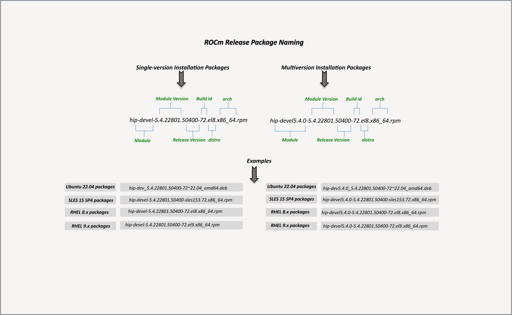
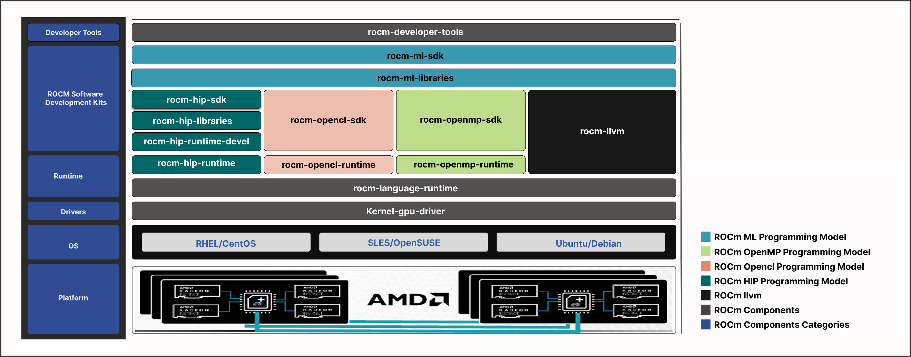

************************************************************************************
Package manager integration
************************************************************************************

This section provides information about the required meta-packages for the
following AMD ROCm programming models:

* Heterogeneous-Computing Interface for Portability (HIP)
* OpenCL™
* OpenMP™

ROCm package naming conventions
============================================================

A meta-package is a grouping of related packages and dependencies used to
support a specific use case.

**Example:** Running HIP applications

All meta-packages exist in both versioned and non-versioned forms.

* Non-versioned packages: For a single-version installation of the ROCm stack
* Versioned packages: For multi-version installations of the ROCm stack

The figure above demonstrates the single and multi-version ROCm packages' naming
structure, including examples for various Linux distributions. See terms below:

*Module* - It is the part of the package that represents the name of the ROCm
component.

**Example:** The examples mentioned in the image represent the ROCm HIP module.

*Module version* - It is the version of the library released in that package. It
should increase with a newer release.

*Release version* - It shows the ROCm release version when the package was
released.

**Example:** `50400` points to the ROCm 5.4.0 release.

*Build id* - It represents the build number for that release.

*Arch* - It shows the architecture for which the package was created.

*Distro* - It describes the distribution for which the package was created. It is
valid only for rpm packages.

**Example:** `el8` represents RHEL 8.x packages.

Components of ROCm programming models
============================================================

The figure below demonstrates the high-level layered architecture of ROCm programming models and their meta-packages.
All meta-packages are a combination of required packages and libraries.

**Example:**

- ``rocm-hip-runtime`` is used to deploy on supported machines to execute HIP
  applications.
- ``rocm-hip-sdk`` contains runtime components to deploy and execute HIP
  applications.  

.. note::
    ``rocm-llvm`` is not a meta-package; it's a single package that installs the ROCm Clang compiler files.

.. csv-table::
  :widths: 30, 70
  :header: "Package", "Description"

    ``rocm``, All ROCm core packages, tools, and libraries.
    ``rocm-language-runtime``, The ROCm runtime.
    ``rocm-developer-tools``, Debug and profile HIP applications.
    ``rocm-hip-runtime``, Run HIP applications writen for the AMD platform.
    ``rocm-hip-runtime-devel``, Develop applications on HIP or port from CUDA.
    ``rocm-opencl-runtime``, Run OpenCL-based applications on the AMD platform.
    ``rocm-opencl-sdk``, Develop OpenCL-based applications for the AMD platform.
    ``rocm-hip-libraries``, HIP libraries optimized for the AMD platform.
    ``rocm-hip-sdk``, Develop or port HIP applications and libraries for the AMD platform.
    ``rocm-ml-libraries``, Key machine learning libraries. Includes MIOpen.
    ``rocm-ml-sdk``, Develop and run machine learning applications for AMD.
    ``rocm-openmp-runtime``, Run OpenMP-based applications on the AMD platform.
    ``rocm-openmp-sdk``, Develop OpenMP-based applications for the AMD software.

Packages in ROCm programming models
============================================================

This section discusses the available meta-packages and their packages.
The following table shows the meta-packages and their associated (meta-)packages in a ROCm programming model.

.. table::
  :widths: 30 70

  +----------------------------+---------------------------------+
  | Meta package               | Associated packages             |
  +============================+=================================+
  | ``rocm``                   | Meta packages:                  |
  |                            |                                 |
  |                            | ``rocm-developer-tools``,       |
  |                            | ``rocm-ml-sdk``,                |
  |                            | ``rocm-opencl-sdk``,            |
  |                            | ``rocm-openmp-sdk``             |
  |                            |                                 |
  |                            | Packages:                       |
  |                            |                                 |
  |                            | ``migraphx``,                   |
  |                            | ``mivisionx``                   |
  +----------------------------+---------------------------------+
  | ``rocm-developer-tools``   | Meta packages:                  |
  |                            |                                 |
  |                            | ``rocm-language-runtime``       |
  |                            |                                 |
  |                            | Packages:                       |
  |                            |                                 |
  |                            | ``hsa-amd-aqlprofile``,         |
  |                            | ``rocm-core``,                  |
  |                            | ``rocm-dbgapi``,                |
  |                            | ``rocm-debug-agent``,           |
  |                            | ``rocm-gdb``,                   |
  |                            | ``rocprofiler-devel``,          |
  |                            | ``roctracer-devel``,            |
  |                            | ``amd-smi-lib``,                |
  |                            | ``rocm-smi-lib``,               |
  |                            | ``rocprofiler``,                |
  |                            | ``rocprofiler-plugins``,        |
  |                            | ``roctracer``                   |
  +----------------------------+---------------------------------+
  | ``rocm-mi-sdk``            | Meta packages:                  |
  |                            |                                 |
  |                            | ``rocm-hip-sdk``,               |
  |                            | ``rocm-ml-libraries``           |
  |                            |                                 |
  |                            | Packages:                       |
  |                            |                                 |
  |                            | ``miopen-hip-devel``,           |
  |                            | ``rocm-core``                   |
  +----------------------------+---------------------------------+
  | ``rocm-ml-libraries``      | Meta packages:                  |
  |                            |                                 |
  |                            | ``rocm-hip-libraries``          |
  |                            |                                 |
  |                            | Packages:                       |
  |                            |                                 |
  |                            | ``miopen-hip``,                 |
  |                            | ``rocm-core``,                  |
  |                            | ``rocm-llvm``                   |
  +----------------------------+---------------------------------+
  | ``rocm-hip-sdk``           | Meta packages:                  |
  |                            |                                 |
  |                            | ``rocm-hip-runtime-devel``      |
  |                            |                                 |
  |                            | Packages:                       |
  |                            |                                 |
  |                            | ``composablekernel-devel``,     |
  |                            | ``hipblas-devel``,              |
  |                            | ``hipblaslt-devel``,            |
  |                            | ``hipcub-devel``,               |
  |                            | ``hipfft-devel``,               |
  |                            | ``hipfort-devel``,              |
  |                            | ``hiprand-dev``,                |
  |                            | ``hipsolver-devel``,            |
  |                            | ``hipsparse-devel``,            |
  |                            | ``hiptensor-dev``,              |
  |                            | ``rccl-devel``,                 |
  |                            | ``rocalution-devel``,           |
  |                            | ``rocblas-devel``,              |
  |                            | ``rocfft-devel``,               |
  |                            | ``rocm-core``,                  |
  |                            | ``rocprim-devel``,              |
  |                            | ``rocrand-devel``,              |
  |                            | ``rocsolver-devel``,            |
  |                            | ``rocsparse-devel``,            |
  |                            | ``rocthrust-devel``,            |
  |                            | ``rocwmma-devel``               |
  +----------------------------+---------------------------------+
  | ``rocm-hip-libraries``     | Meta packages:                  |
  |                            |                                 |
  |                            | ``rocm-hip-runtime``            |
  |                            |                                 |
  |                            | Packages:                       |
  |                            |                                 |
  |                            | ``hipblas``,                    |
  |                            | ``hipblaslt``,                  |
  |                            | ``hipfft``,                     |
  |                            | ``hipfort``,                    |
  |                            | ``hiprand``,                    |
  |                            | ``hipsolver``,                  |
  |                            | ``hipsparse``,                  |
  |                            | ``hiptensor``,                  |
  |                            | ``rccl``,                       |
  |                            | ``rocalution``,                 |
  |                            | ``rocblas``,                    |
  |                            | ``rocfft``,                     |
  |                            | ``rocm-core``,                  |
  |                            | ``rocrand``,                    |
  |                            | ``rocsolver``,                  |
  |                            | ``rocsparse``                   |
  +----------------------------+---------------------------------+
  | ``rocm-openmp-sdk``        | Meta packages:                  |
  |                            |                                 |
  |                            | ``rocm-language-runtime``       |
  |                            |                                 |
  |                            | Packages:                       |
  |                            |                                 |
  |                            | ``openmp-extras-devel``,        |
  |                            | ``rocm-core``,                  |
  |                            | ``rocm-llvm``                   |
  +----------------------------+---------------------------------+
  | ``rocm-opencl-sdk``        | Meta packages:                  |
  |                            |                                 |
  |                            | ``rocm-opencl-runtime``         |
  |                            |                                 |
  |                            | Packages:                       |
  |                            |                                 |
  |                            | ``hsa-rocr-devel``,             |
  |                            | ``hsamk-roct-devel``,           |
  |                            | ``rocm-core``,                  |
  |                            | ``rocm-opencl-devel``           |
  +----------------------------+---------------------------------+
  | ``rocm-opencl-runtime``    | Meta packages:                  |
  |                            |                                 |
  |                            | ``rocm-language-runtime``       |
  |                            |                                 |
  |                            | Packages:                       |
  |                            |                                 |
  |                            | ``rocm-core``,                  |
  |                            | ``rocm-ocl-lcd``,               |
  |                            | ``rocm-opencl``                 |
  +----------------------------+---------------------------------+
  | ``rocm-hip-runtime-devel`` | Meta packages:                  |
  |                            |                                 |
  |                            | ``rocm-hip-runtime``            |
  |                            |                                 |
  |                            | Packages:                       |
  |                            |                                 |
  |                            | ``hip-devel``,                  |
  |                            | ``hipify-cclang``,              |
  |                            | ``hsa-rocr-devel``,             |
  |                            | ``hsakmt-roct-devel``,          |
  |                            | ``rocm-cmake``,                 |
  |                            | ``rocm-core``,                  |
  |                            | ``rocm-llvm``                   |
  +----------------------------+---------------------------------+
  | ``rocm-hip-runtime``       | Meta packages:                  |
  |                            |                                 |
  |                            | ``rocm-language-runtime``       |
  |                            |                                 |
  |                            | Packages:                       |
  |                            |                                 |
  |                            | ``hip-runtime-amd``,            |
  |                            | ``rocm-core``,                  |
  |                            | ``rocminfo``                    |
  +----------------------------+---------------------------------+
  | ``rocm-language-runtime``  | Packages:                       |
  |                            |                                 |
  |                            | ``comgr``,                      |
  |                            | ``hsa-rocr``,                   |
  |                            | ``openmp-extras-runtime``,      |
  |                            | ``rocm-core``                   |
  +----------------------------+---------------------------------+

.. note::
    The figure above is for informational purposes only, as the individual packages in a meta-package are subject to change.
    Install meta-packages, and not individual packages, to avoid conflicts.
