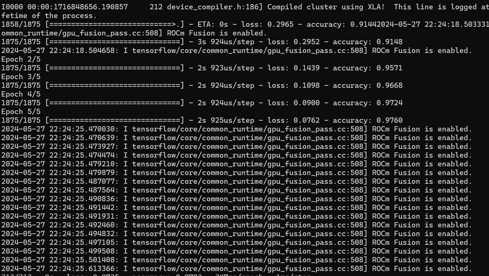

.. meta::
  :description: Installing TensorFlow for ROCm
  :keywords: installation instructions, TensorFlow, AMD, ROCm

****************************************************************************************
Installing TensorFlow for ROCm
****************************************************************************************

TensorFlow is an open-source library for solving machine learning,
deep learning, and AI problems. It can solve many
problems across different sectors and industries, but primarily focuses on
neural network training and inference. It is one of the most popular and
in-demand frameworks and is very active in open-source contribution and
development.

.. note::

   As of ROCm 6.1, ``tensorflow-rocm`` packages are found at `<https://repo.radeon.com/rocm/manylinux>`__.
   Prior to ROCm 6.1, packages were found at `<https://pypi.org/project/tensorflow-rocm>`_.

.. _install-tensorflow-versions:

.. list-table::
    :header-rows: 1
    :widths: 1, 1

    * - ROCm version
      - TensorFlow version
    * - 6.2.x
      - 2.14.1, 2.15.1, 2.16.1
    * - 6.1.x
      - 2.13.1, 2.14.0, 2.15.0
    * - 6.0.x
      - 2.12.1, 2.13.1, 2.14.0

.. _install-tensorflow-options:

Installing TensorFlow
===============================================

The following section describes TensorFlow installation options.

.. _install-tensorflow-prebuilt-docker:

Using a prebuilt Docker image
-------------------------------------------------------------------------------

To install ROCm on bare metal, follow
:doc:`/install/install-overview`. The recommended option to
get a TensorFlow environment is through Docker.

Using Docker provides portability and access to a prebuilt Docker image that
has been rigorously tested within AMD. This can also save compilation time and
should perform as tested and mitigate potential installation issues.

Follow these steps:

1. Pull the latest public TensorFlow Docker image.

   .. code-block:: shell

       docker pull rocm/tensorflow:latest

2. Once you have pulled the image, run it by using the command below:

   .. code-block:: shell

       docker run -it --network=host --device=/dev/kfd --device=/dev/dri \
       --ipc=host --shm-size 16G --group-add video --cap-add=SYS_PTRACE \
       --security-opt seccomp=unconfined rocm/tensorflow:latest

Refer to the :doc:`Docker image support matrix </reference/docker-image-support-matrix>` for a list of prebuilt
Docker image tags for TensorFlow with ROCm.

.. _install-tensorflow-wheels:

Using a wheels package
-------------------------------------------------------------------------------

To install TensorFlow using the wheels package, use the following command.

.. code-block:: shell

   pip install --user tensorflow-rocm==[wheel-version] -f [repo] --upgrade

* ``[wheel-version]`` is the :ref:`TensorFlow version <install-tensorflow-versions>`.

* ``[repo]`` is ``https://repo.radeon.com/rocm/manylinux/rocm-rel-X.Y/`` for versions 6.1 and later,
  where ``X.Y`` indicates the :ref:`ROCm version <install-tensorflow-versions>`.

.. note::

   Prior to ROCm 6.1, ``[wheel-version]`` followed the ``<TensorFlowVersion>.<ROCmVersion>`` format.

.. _test-tensorflow-installation:

Testing the TensorFlow installation
=======================================

To test the installation of TensorFlow, run the container as specified in
:ref:`Installing TensorFlow <install-tensorflow-options>`. Ensure you have access to the Python
shell in the Docker container.

.. code-block:: shell

    python -c 'import tensorflow' 2> /dev/null && echo ‘Success’ || echo ‘Failure’

Running a basic TensorFlow example
======================================

To quickly validate your TensorFlow environment, let's run a basic TensorFlow example.

The MNIST dataset is a collection of handwritten digits that may be used to train a Convolutional Neural Network (CNN)
for handwriting recognition. This dataset is included with your TensorFlow installation.

Run the following sample code to load the MNIST dataset, then train and evaluate it.

.. code-block:: python

   import tensorflow as tf
   print("TensorFlow version:", tf.__version__)
   mnist = tf.keras.datasets.mnist
   
   (x_train, y_train), (x_test, y_test) = mnist.load_data()
   x_train, x_test = x_train / 255.0, x_test / 255.0
   model = tf.keras.models.Sequential([
     tf.keras.layers.Flatten(input_shape=(28, 28)),
     tf.keras.layers.Dense(128, activation='relu'),
     tf.keras.layers.Dropout(0.2),
     tf.keras.layers.Dense(10)
   ])
   predictions = model(x_train[:1]).numpy()
   tf.nn.softmax(predictions).numpy()
   loss_fn = tf.keras.losses.SparseCategoricalCrossentropy(from_logits=True)
   loss_fn(y_train[:1], predictions).numpy()
   model.compile(optimizer='adam',
                 loss=loss_fn,
                 metrics=['accuracy'])
   model.fit(x_train, y_train, epochs=5)
   model.evaluate(x_test,  y_test, verbose=2)

If successful, you should see the following output indicating the image classifier is now trained to around 98% accuracy
on this dataset.

