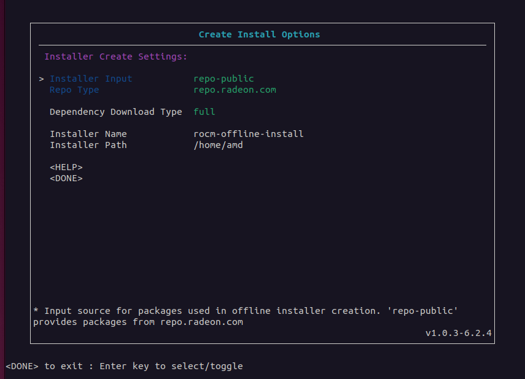
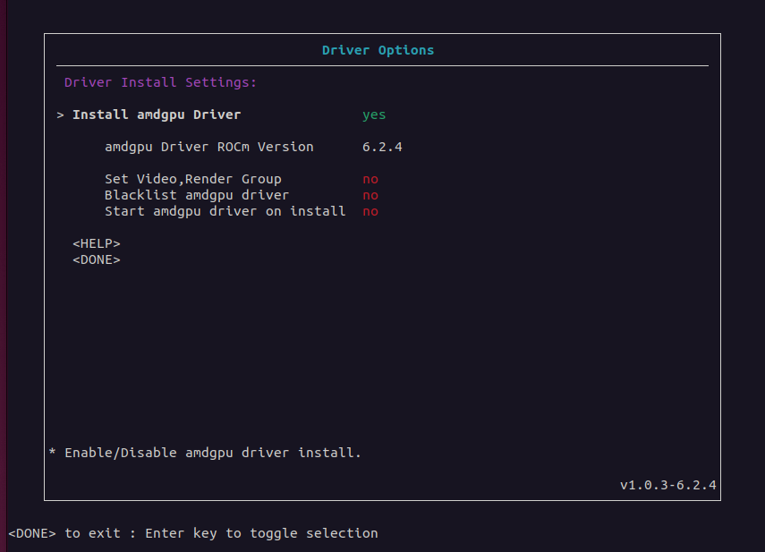
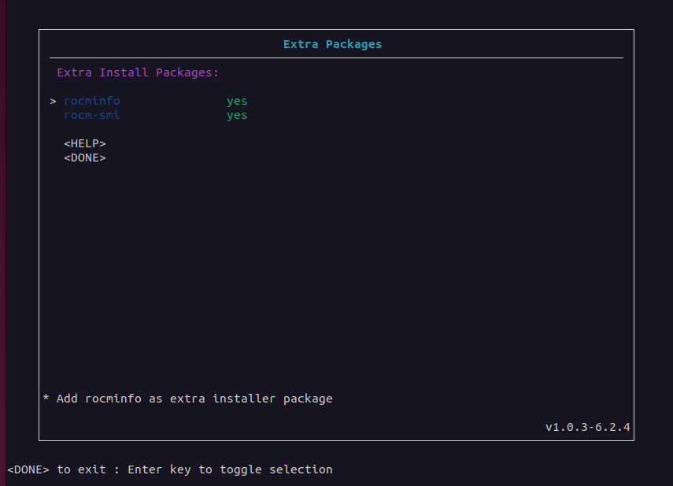
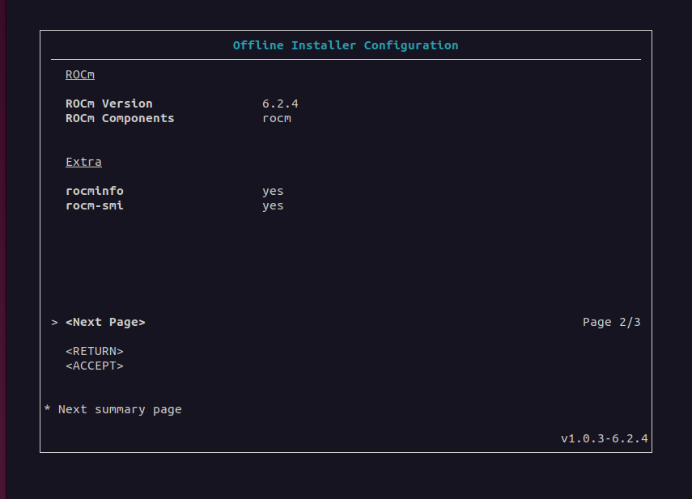
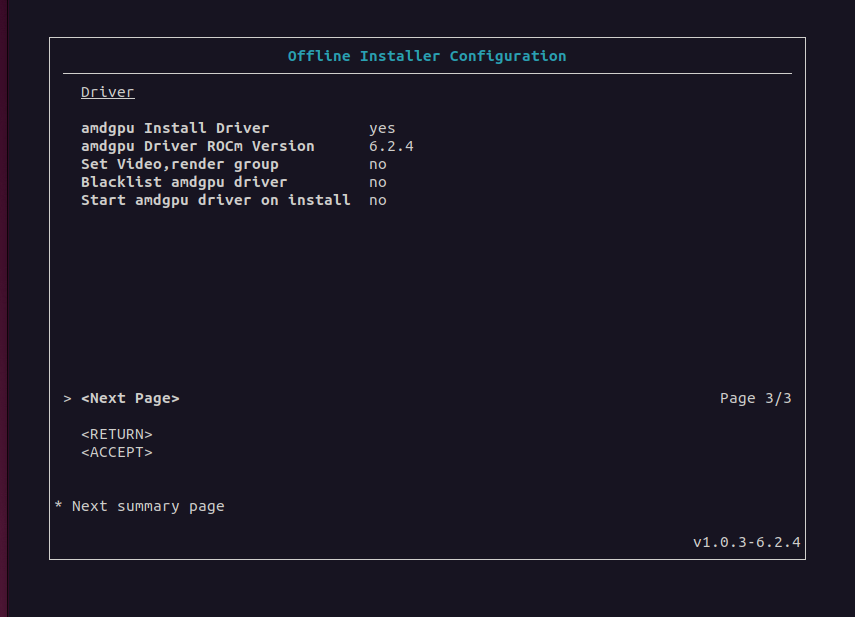

.. meta::
  :description: ROCm offline installer
  :keywords: ROCm installation, AMD, ROCm, third-party support matrix

***************************************************************************
ROCm Offline Installer Creator
***************************************************************************

The ROCm Offline Installer Creator creates an 
installation package for a preconfigured setup of ROCm, the AMDGPU driver, or a combination
of the two on a target system without network or internet access.

On a system with internet access (known as the *host*), the tool creates an installer package. It uses the host system 
as the template for a matching offline system (known as a *target*). After creating the offline installer 
package, you can run it on a target without network access to install ROCm and the AMDGPU driver.

The ROCm Offline Installer Creator lets you  
customize multiple unique configurations for use when
installing ROCm on a target.

The ROCm Offline Installer Creator features:

* A lightweight user interface
* An easy-to-use user interface for configuring the creation of the installer
* Support for multiple Linux distributions
* Installer support for different ROCm releases
* Installer support for specific ROCm components
* Optional driver or driver-only installer creation
* Optional post-install preferences
* Lightweight installer packages, which are unique to the preconfigured ROCm setup
* Resolution and inclusion of dependency packages for offline installation

Prerequisites
================================================

The ROCm Offline Installer Creator requires the following configuration:

* The host must be connected to the network and internet when running the ROCm Offline Installer Creator.
* The host system running the ROCm Offline Installer Creator and the target system running the installer 
  must use the same Linux distribution, release version, and Linux kernel version.

For example, if the host system uses 
Ubuntu 22.04.4 with the 6.5.0-44-generic kernel, only an Ubuntu 22.04.4 target with the 6.5.0-44-generic kernel 
can use the offline installer. 
If the base OS distribution version and the kernel version of that distribution do not match on both systems, 
installation is not permitted.

The following configuration is recommended when using the ROCm Offline Installer Creator:

* The host system running the ROCm Offline Installer Creator and the target system should use the same OS image and 
  have the same packages installed.
* The host OS should not have ROCm or the AMDGPU driver installed. (This recommendation doesn't 
  apply to any AMDGPU drivers included with the default distribution packages.)

Supported Linux distributions
================================================

The ROCm Offline Installer Creator tool supports the following Linux distributions and versions:

* Ubuntu: 20.04, 22.04, 24.04
* RHEL: 8.9, 8.10, 9.2, 9.3, 9.4
* SLES: 15.5, 15.6

Getting started
================================================

The ROCm Offline Installer Creator is distributed as a self-extracting ``.run`` package. Launch the tool from
any directory on the host system to create an offline installer.

Download the Offline Installer Creator from ``repo.radeon.com`` using the following command:

.. code-block:: shell

   wget https://repo.radeon.com/rocm/installer/rocm-linux-install-offline/rocm-rel-<rocm-version>/<distro>/<distro-version>/<creator-package>

Substitute your values for the following placeholders:

* ``<rocm-version>``: ROCm version number for the ROCm Offline Installer Creator tool.
* ``<distro>``: Linux distribution for the tool.
* ``<distro-version>``: Linux distribution version for the tool.
* ``<creator-package>``: The ROCm Offline Installer Creator package name.

For example, use this command to download ROCm version 6.2 of the Offline Installer Creator 
for Ubuntu release 22.04:

.. code-block:: shell

   wget https://repo.radeon.com/rocm/installer/rocm-linux-install-offline/rocm-rel-6.2/ubuntu/22.04/rocm-offline-creator_1.0.0.60200-3~22.04.run

Installer Creation
================================================

On the host system, run the ROCm Offline Installer Creator from the terminal command line as follows:

.. code-block:: shell

   ./rocm-offline-creator_1.0.0-local.run <options>

The ``<options>`` parameter can either be left empty or set to these options:

*  ``help``: displays information on how to use the Offline Installer Creator
*  ``version``: displays the current version of the Offline Installer Creator
*  ``prompt``: enables user prompts during offline installer creation
*  ``config=``: specifies the full path to a ``.config`` file that contains a configuration for creating an offline installer.
   This parameter is used for testing purposes. See the :ref:`testing` section for more information.
*  ``wconfig=``: specifies the full path to a ``.config`` file that is created using the current configuration settings when the user exits the user interface.
   When this option is specified, the ROCm Offline Installer Creator does not create an installer package. This option is used for testing purposes.

.. note::

   The ``prompt`` and ``config`` options can be combined in the same command.

This example demonstrates how to use the ``prompt`` option when running the Offline Installer Creator:

.. code-block:: shell

   ./rocm-offline-creator_1.0.0-local.run prompt

The optional ``prompt`` parameter stops the Offline Installer Creator
at critical checkpoints in the creation process and prompts the user. At these checkpoints, 
the user can either continue or end the program. Without the ``prompt`` parameter, installer creation continues 
without interruption, unless a failure occurs during the process.

After extracting the ``.run`` package, the Offline Installer Creator displays 
the **Main** menu. From here, you can customize the offline installer using the **Create Configuration** 
menu and options in the ROCm, driver, and extra packages menus. 

After configuring all the options, select **Create Offline Installer** to review the settings
and start the offline installer creation process. After the installer is created, the offline installer ``.run`` package
is saved to the configured location. Copy this package to any matching target system for ROCm 
and driver installation.

Offline Installer Creator interface
================================================

Use the Offline Installer Creator user interface to configure the contents of the ROCm and 
driver installation package for later use on the target system.  

Starting from the **Main** menu, the Offline Installer Creator user interface contains multiple menus and sub-menus 
used to configure and create the offline installer. The following section describes the
menu items: 

* :ref:`Main <main-label>`
* :ref:`Create Configuration <create-configuration-label>`
* :ref:`ROCm Options <rocm-options-label>`
* :ref:`Driver Options <driver-options-label>`
* :ref:`Extra Packages <extra-packages-label>`
* :ref:`Create Offline Installer <create-offline-installer-label>`

.. _main-label:

Main menu
-------------------------------------------------------------------------

The **Main** menu is the starting point for installer configuration.

.. _create-configuration-label:

Create Configuration menu
-------------------------------------------------------------------------

The **Create Configuration** menu selects the input source and output parameters for the 
installer. Configuration items in this menu include the input repository, the type of dependency downloading to 
perform, and the name and output location for the new installer. 

* **Installer Input**

  The **Installer Input** indicates the input repository 
  for sourcing the ROCm and driver packages used to build the offline installer. A value of ``repo-public`` 
  indicates that a publicly-available repository, as defined in the **Repo Type** field, is used for the package input.

* **Repo Type**

  The **Repo Type** indicates the specific type of repository 
  used for input. If the value of **Installer Input** is set to ``repo-public``, then ``repo.radeon.com`` 
  is used to source and download any ROCm and driver packages required to create the offline installer.

* **Dependency Download Type** 

  To create an offline installer, any package downloaded and installed on the 
  target system must include any dependent packages required for offline installation. 
  The Offline Installer Creator provides two options for controlling how dependent packages are included: 
  ``full`` and ``minimum``.  

  Set the **Dependency Download Type** to ``full``, the default setting,
  to resolve all dependencies for ROCm and the selected drivers aggressively and recursively 
  and download them as required. Full mode typically results in a larger 
  offline installer than minimum mode. This mode is recommended if the host system running the Offline 
  Installer Creator uses a modified OS image with additional packages installed, 
  such as ROCm. 

  In cases where the host system is running an unmodified OS image that is exactly the same as the target, set the
  **Dependency Download Type** to ``minimum``. This mode downloads the 
  minimum number of dependent packages required to create the offline installer. 
  The resulting offline installer has a smaller size in minimum mode than it does in full mode. 
  A typical use of minimum mode is for distributing a preconfigured OS image 
  as the base installation across multiple offline systems. 
  The base image is used to create an offline installer which is 
  then deployed to the matching offline systems to install ROCm.

* **Installer Name**

  **Installer Name** specifies the name of the offline installer ``.run`` file that is generated. 
  The default option is ``rocm-offline-install``.

* **Installer Path**

  **Installer Path** configures the output directory for the new offline installer on the host system. 
  The default location is the home directory of the current user.   

  .. note::

     The Offline Installer Creator validates the directory path and doesn't permit installer creation 
     if the path is invalid.

.. _rocm-options-label:

ROCm Options menu
-------------------------------------------------------------------------

The optional **ROCm Options** menu includes or excludes the ROCm component in 
the offline installer. If ROCm installation is included, a specific version and set of the ROCm 
components are integrated into the resulting installer.

.. image:: ../data/how-to/rocm-offline-installer-3-rocm-options.png 
   :width: 800
   :alt: The ROCm Options menu for the Offline Installer Creator

* **Install ROCm**

  This field indicates whether to include ROCm components in the offline installer. 
  If this field is set to ``yes``, ROCm installation is enabled. If you choose this configuration, you must select 
  the ROCm version and list of ROCm components. Otherwise, 
  the creation of the offline installer is not permitted. To create a “driver-only” offline installer,
  disable the **Install ROCm** option.

* **ROCm Version**

  If **Install ROCm** is enabled, select a specific version of ROCm using the **ROCm 
  Version** sub-menu. ROCm version 5.7.3 and later are available for selection. 
  All ROCm components are based on this version of ROCm.  

  .. note::

     Only one ROCm version can be selected.

* **ROCm Components**

  If **Install ROCm** is set to ``yes``, you can select a list of components from 
  the **ROCm Components** sub-menu.  These components represent use cases and functions within 
  the ROCm software stack.  For example, ``rocm`` is one of the primary components within
  ROCm. It includes most of the essential parts of the ROCm stack, so most users should 
  include ``rocm`` as a base component for any ROCm offline installer. 

  .. note::

     * Configure the **ROCm Version** field before selecting the ROCm components.
     * Select one or more components from the **ROCm Components** list for offline installer creation.

The following ROCm Components are available for offline installation. For more information on
the components, see :doc:`What is ROCm <rocm:what-is-rocm>`.

* ``rocm``
  
  * For users and developers requiring the full ROCm stack
  * OpenCL (ROCr/KFD based) runtime
  * HIP runtimes
  * Machine-learning framework
  * All ROCm libraries and applications

* ``rocmdev``

  * For developers requiring the ROCm runtime, with profiling and debugging tools
  * HIP runtimes
  * OpenCL runtime
  * Profiler, tracer, and debugger tools

* ``rocmdevtools``

  * For developers requiring the ROCm profiling and debugging tools
  * Profiler, tracer, and debugger tools

* ``lrt``

  * For users of applications using the ROCm runtime
  * ROCm compiler and device libraries
  * ROCr runtime and thunk

* ``hip``

  * For users of the HIP runtime on AMD products
  * HIP runtimes

* ``hiplibsdk``

  * For application developers using HIP on AMD products
  * HIP runtimes
  * ROCm math libraries
  * HIP development libraries

* ``graphics``

  * For users of graphics applications
  * Open-source Mesa 3D graphics and multimedia libraries

* ``multimediasdk``

  * For developers of open-source multimedia
  * Open-source Mesa 3D multimedia libraries
  * Development headers for multimedia libraries

* ``opencl``

  * For users of applications requiring OpenCL on Vega or later products
  * ROCr-based OpenCL
  * ROCm language runtime

* ``openclsdk``

  * For application developers requiring ROCr-based OpenCL
  * ROCr-based OpenCL
  * ROCm language runtime
  * Development and SDK files for ROCr-based OpenCL

* ``openmpsdk``

  * For users of OpenMP or Flang on AMD products
  * OpenMP runtime and development packages

* ``mllib``

  * For users running machine-learning workloads
  * MIOpen hip and tensile libraries
  * Clang OpenCL
  * MIOpen kernels

* ``mlsdk`` 

  * For developers running machine-learning workloads
  * MIOpen development libraries
  * Clang OpenCL development libraries
  * MIOpen kernels

.. _driver-options-label:

Driver Options Menu
-------------------------------------------------------------------------

Use the **Driver Options** menu to optionally include the AMDGPU driver in the 
offline installer. If driver installation is included, an AMDGPU driver based on a specific ROCm version 
is integrated into the installer. In addition, the installer can configure several post-installation driver 
options for offline installation.

* **Install amdgpu Driver**

  This field specifies whether to include the AMDGPU driver in the offline installer. 
  To enable its inclusion, set the value of **Install amdgpu Driver** to ``yes``.
  To include the driver, select the **amdgpu Driver ROCm Version**. Otherwise, 
  the creation of an offline installer is not permitted. This option is typically disabled
  when creating an ROCm-only offline installer.

* **amdgpu Driver ROCm Version**

  If **Install amdgpu Driver** is set to ``yes``, the **amdgpu Driver ROCm Version** field is used to select a 
  specific ROCm version to base the AMDGPU driver on. 

  .. note::

     *  The offline installer can only use one ROCm version.
     *  The AMDGPU driver included in the offline installer is the DKMS version.

Post-install driver options
^^^^^^^^^^^^^^^^^^^^^^^^^^^^^^^^^^^^^^^^^^^^^^^^^

If you are including the AMDGPU driver in the offline installer, you can apply one or more
of the following post-installation driver options:

* **Set Video,Render Group**

  When this setting is enabled, the resulting offline installer adds the current user (``$USER``) to the ``render`` 
  and ``video`` groups on the target system after installing AMDGPU. In most cases, you
  must belong to both groups before any ROCm 
  components can use the AMDGPU driver or access GPU resources.

  .. note::

     Enabling this post-installation option is recommended.

* **Blacklist amdgpu driver**

  When this setting is enabled, the resulting offline installer immediately 
  disables the AMDGPU driver kernel module after installing it. As a result,  
  the system disables driver startup and initialization on subsequent reboots. Use this
  option when the AMDGPU driver is being debugged or is potentially unstable, 
  or if control of driver initialization is required during boot up.

  .. caution::

     This option is intended for advanced users familiar with Linux kernel modules and GPU drivers.

  .. note::

     If this option is selected, the **Start amdgpu driver on install** option is not available.

* **Start amdgpu driver on install**

  If the **Start amdgpu driver on install** option is enabled, the offline installer uses ``modprobe``
  to automatically launch the AMDGPU driver after installation. If a pre-existing AMDGPU driver is 
  already loaded on the system, the installer doesn't start the new driver.
  This option is often useful for users installing the driver on a system where the GPU device is newer and 
  not yet natively supported as part of the upstream GPU driver for the Linux distribution. 

  .. note::

     If this option is selected, the **Blacklist amdgpu driver on install** option is not
     available for use in the offline installer.

.. _extra-packages-label:

Extra Packages Menu
-------------------------------------------------------------------------

The **Extra Packages** menu provides a list of optional packages for inclusion
in the offline installer. You can select the :doc:`rocminfo <rocminfo:index>` and 
:doc:`rocm-smi <rocm_smi_lib:index>` packages 
as extra packages for the installer, provided they are not already included 
as part of a given ROCm component.

.. note::

   If a selected ROCm component already includes rocminfo or rocm-smi, the fields are set to ``yes`` and
   can't be modified.

.. _create-offline-installer-label:

Create Offline Installer Menu
-------------------------------------------------------------------------

The **Create Offline Installer** menu summarizes the current configuration. The 
Offline Installer Creator uses this configuration to create the offline installer.
If there are no errors, you can **Accept** the configuration and create the offline installer ``.run`` file. 
If the tool finds any missing requirements or errors in the configuration, the **Accept** option is not available. 
In this case, return to the **Main** menu by selecting **Return** and edit the current configuration 
before proceeding.

The following illustrations show the three menu pages required to 
create the offline installer.

Using the ROCm Offline Installer Creator
================================================

After starting the Offline Installer Creator, the user interface appears in the terminal. 
At the top of the **Main** menu, the **Target Installer** field indicates the Linux 
distribution, version, and Linux kernel version currently running on the host system. 
The target system must match the host system because the target installer 
is based on the current host distribution and kernel version. When navigating through the menus, 
you can use the **Done** option to return to the previous menu. Some menus have a **Help** option
to display more information about the current menu.

Follow these steps to create an offline installer:

#. Fill out the configuration creation details:

   a. Enter the **Create Configuration** menu.
   b. Set the **Dependency Download Type** to either ``full``, which is the default, or ``minimum``.
   c. Set the **Installer Name** field or use the default name that is provided. The Offline Installer Creator 
      appends the ``.run`` extension to the installer name when it creates the installer.
   d. Use the **Installer Path** field to configure the output directory for the installer.  
      The default value is the ``$USER`` home directory.

#. Set the ROCm options:

   In the **ROCm Options** menu, enable or disable the installation of ROCm components. If ROCm installation is enabled,
   the **ROCm Version** and **ROCm Components** fields are also required.

   a. Enter the **ROCm Options** menu.
   b. Set **Install ROCm** to ``yes`` to include ROCm components in the offline installer.
   c. For the **ROCm Version** field, select the ROCm release version from the sub-menu.
   d. For the **ROCm Components** field, select one or more ROCm components from the sub-menu.

#. Set the driver options:

   In the **Driver Options** menu, enable or disable the installation of the amdgpu driver. To enable
   driver installation, you must also configure the **amdgpu Driver ROCm version** field.

   a. Enter the **Driver Options** menu.
   b. Set **Install amdgpu Driver** to ``yes`` to include the amdgpu driver in the offline installer.
   c. If the **amdgpu Driver ROCm Version** field is not already populated,
      select the ROCm release version from the sub-menu.
   d. Configure the post-installation driver options, including **Set Video,Render Group**, **Blacklist 
      amdgpu driver**, and **Start amdgpu driver on install**.

   .. note::

       *  Enabling the **Set Video,Render Group** option is recommended. 
          However, the post-installation options aren't required to create or use the installer.
       *  The **amdgpu Driver ROCm Version** field is the same field as the **ROCm Version** field in the **ROCm Options** menu. 
          You can set the ROCm release version from either menu.

#. Set the extra packages:

   In the **Extra Packages** menu, optionally include one or both of the rocminfo and rocm-smi packages
   in the offline installer.

   .. note::

      Some ROCm components already include the rocminfo and rocm-smi packages, which are
      automatically added to the offline installer by default. If so, the user interface 
      sets the **rocminfo** and **rocm-smi** fields to ``yes`` and ensures they can't be edited. 

#. Create the installer:

   After completing the previous steps, you can create the offline installer.

   a. Enter the **Create Offline Installer** menu.
   b. Review the current installer configuration by using the review summary interface, pressing **<Next Page>** to cycle 
      through the pages.
   c. If there are any errors or missing requirements in the configuration, press **<RETURN>** to display 
      the main menu and make any required changes. Any errors or missing requirements are indicated in red.
   d. If there are no errors in the configuration, select **<ACCEPT>** to create the 
      offline installer, which is saved to the designated location.
   e. At this point, the user interface closes and the offline install creation script starts running.

   .. note::

      You can only select **<ACCEPT>** if all configuration requirements 
      are met and no errors are detected.

#. Offline Installation:

   After the offline installer has been created and saved to the designated output directory
   on the host system, copy the installer to any matching target system and run it. The target 
   doesn't need to have a network or internet connection.

   a. Copy the offline installer, for example ``rocm-offline-install.run``, to a target system that matches the host.
   b. Run the installer from the terminal command line:

      .. code-block:: shell 

         ./rocm-offline-install.run <option>

      The ``option`` parameter can either be omitted or optionally set to ``prompt`` or ``dryrun``.
      The ``prompt`` option enables user prompts 
      during the offline installation process. If the ``prompt`` parameter is appended,
      the installer halts at critical points during the installation process, prompting the user
      to continue or stop the installation.   
      Without the ``prompt`` parameter, the offline installation runs until completion, unless a 
      failure occurs during the process.

      To simulate the offline installation process, set the ``option`` parameter to ``dryrun``. 
      With ``dryrun``, the installer outputs any errors it detects but does not install any packages.

      .. code-block:: shell 

         ./rocm-offline-install.run prompt

      or

      .. code-block:: shell 

         ./rocm-offline-install.run dryrun

      .. note::

         You can run the installer with both the ``dryrun`` and ``prompt`` options. 
         This simulates the offline installation and prompts you during the process.

Log files
-----------------------------------

By default, the ROCm Offline Installer Creator records its output in log files 
in the ``/var/log/offline_creator`` directory. The output of both creation and installation 
processes is logged to this directory.

.. _building-label:

Building
================================================

Build the ROCm Offline Installer Creator from source using the files located at  
`<https://github.com/ROCm/rocm-install-on-linux/tree/develop/src/offline-installer>`_.

To build the Offline Installer Creator:

#. Install the prerequisites

   You must install the following packages prior to building the Offline Installer Creator from source.

   .. tab-set::

      .. tab-item:: Ubuntu
         :sync: ubuntu

         .. code-block:: bash

            sudo apt install cmake
            sudo apt install build-essential
            sudo apt install libncurses5-dev
            sudo apt install makeself
            sudo apt install wget

      .. tab-item:: Red Hat Enterprise Linux
         :sync: RHEL

         First, install the RHEL version-specific prerequisites:

         Install the following for RHEL 8.x:

         .. code-block:: bash

            sudo dnf install wget
            wget https://dl.fedoraproject.org/pub/epel/epel-release-latest-8.noarch.rpm
            sudo rpm -ivh epel-release-latest-8.noarch.rpm
            sudo crb enable

         Install the following for RHEL 9.x:

         .. code-block:: bash

            sudo dnf install wget
            wget https://dl.fedoraproject.org/pub/epel/epel-release-latest-9.noarch.rpm
            sudo rpm -ivh epel-release-latest-9.noarch.rpm
            sudo crb enable

         Then install the generic RHEL x.x prerequisites

         .. code-block:: bash

            sudo dnf install cmake
            sudo dnf install gcc gcc-c++
            sudo dnf install ncurses-devel
            sudo dnf install makeself

      .. tab-item:: SUSE Linux Enterprise Server
         :sync: SLES

         Install the following for SLES 15.5:

         .. code-block:: bash

            SUSEConnect -p PackageHub/15.5/x86_64
            sudo zypper install cmake
            sudo zypper install gcc gcc-c++
            sudo zypper install ncurses-devel
            sudo zypper install makeself

         Install the following for SLES 15.6:

         .. code-block:: bash

            SUSEConnect -p PackageHub/15.6/x86_64
            sudo zypper install cmake
            sudo zypper install gcc gcc-c++
            sudo zypper install ncurses-devel
            sudo zypper install makeself

#. Clone the tool source

   .. code-block:: shell 

      git clone https://github.com/ROCm/rocm-install-on-linux

#. Build the configuration

   .. code-block:: shell 

      cd rocm-install-on-linux/src/offline-installer
      mkdir build 
      cd build
      cmake ..

#. Build the Offline Installer Creator

   The Offline Installer Creator is built for both standard and test use. 
   The output is placed in the CMake build directory.

   * To build the tool, run the following command:

     .. code-block:: shell 

        make

     This command generates the file ``rocm-offline-creator_1.0.0-local.run``.

.. _testing:

Testing
================================================

The Offline Installer Creator test suite includes a set of tests for validating   
common installer configurations. These tests simulate and validate the creation of the target offline installer and 
the installer's behavior.

The tests are based on the ROCm version and on the components being installed.

Tests are available for these ROCm versions:

*  5.7.3
*  6.0.2
*  6.1.x
*  6.2.x

Tests are available for the following component combinations:

*  ROCm only: Creates an installer for the rocm component only.
*  Driver only: Creates an installer for the amdgpu driver only.
*  ROCm and driver: Creates an installer for both the rocm component and the amdgpu driver.
*  ROCm and graphics: Creates an installer for the ``rocm,graphics`` component.
*  ``hip`` and ``hiplibsdk``: Creates an installer for the ``hip,hiplibsdk`` component.

Building the tests
-----------------------------------

Tests are built using CMake and ``make``. See the :ref:`building-label` section above.

.. _running-the-tests:

Running the tests
-----------------------------------

Run the preconfigured tests using the CMake and CTest utilities.

.. note::

   Run any of the tests below with the ``-V`` argument to enable verbose logging and output for the offline 
   installer tool creator or installer scripts.

There are two test types:

*  Full test
*  ROCm version test

For each type of test, installer creation is validated using one of the preset ``.config`` files 
located in the ``tests`` directory. 
These files contain the settings required to create the offline installer. They 
run through the ``create-offline.sh`` script for the relevant Linux distribution. This  
is followed by a dry run of the resulting offline installer ``.run`` file, which performs a simulated 
installation for the distribution under test.

Full test
^^^^^^^^^^^^^^^^^^^^^^^^^^^^^^^^^^^^^^^^^^^^^^^^^

From the build location of the offline tool, run the following command:

.. code-block:: shell 

   ctest

This suite runs 100 tests.

The following tests are available, depending on the ROCm version:

.. csv-table:: 
   :header: "ROCm version", "Test Suite Support"
   :widths: 26, 80

   "6.2.x", "ROCm only, Driver only, ROCm + Driver, ROCm + graphics, hip + hiplibsdk"
   "6.1.x", "ROCm only, Driver only, ROCm + Driver, ROCm + graphics, hip + hiplibsdk"
   "6.0.2", "ROCm only, Driver only, ROCm + Driver, ROCm + graphics, hip + hiplibsdk"
   "5.7.3", "ROCm only, Driver only, ROCm + Driver, ROCm + graphics, hip + hiplibsdk"

.. note::
   
   Test suites for a ROCm version only run if the version is supported on the 
   Linux Distribution Version under test.

ROCm version test
^^^^^^^^^^^^^^^^^^^^^^^^^^^^^^^^^^^^^^^^^^^^^^^^^

Select subsets of the "Full" test for a specific version of ROCm and run them using CTest.

From the build location of the offline tool, run the following command:

.. code-block:: shell 

   ctest -L <rocm-version> 

where ``<rocm-version>`` is one of ``5.7.3``, ``6.0.2``, ``6.1.x``, or ``6.2.x``.
 
Running manual tests
^^^^^^^^^^^^^^^^^^^^^^^^^^^^^^^^^^^^^^^^^^^^^^^^^

In addition to the preconfigured CTest utilities, you can manually configure your own Offline Installer 
Creator tests. This configuration option bypasses the user interface and runs 
the ``create-offline.sh`` script as described in the :ref:`running-the-tests` section above. 
To manually test the creation of an offline installer without the user interface, run the
Offline Installer Creator with the ``config`` parameter.

.. caution::

   For normal Offline Installer Creator usage, the user interface is recommended. 
   The user interface validates the various configuration file inputs and guides you through the
   configuration process.

.. code-block:: shell 

   ./rocm-offline-creator_1.0.0-local.run config=[path-to-config-file]

Set the ``config`` parameter to the absolute path to a configuration file. The file name must include 
the ``.config`` file extension. The file follows the format defined by the Offline Installer Creator
user interface. Example configuration files, which are used for running the CTest utilities,
are available in the ``tests`` directory of the ``offline-installer`` repository.