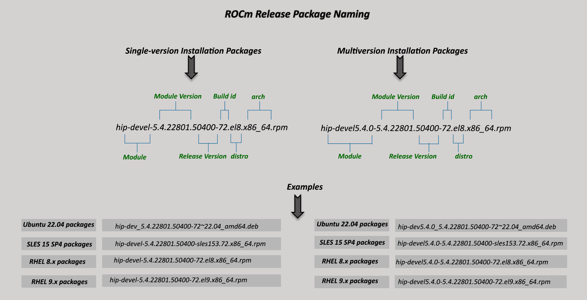
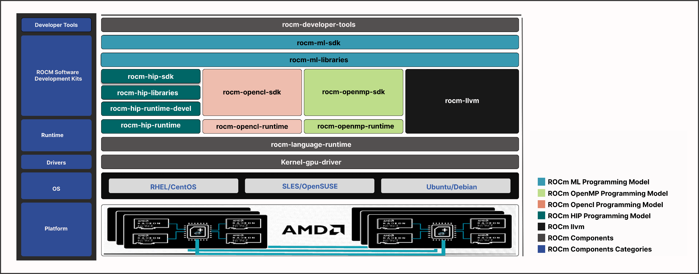

.. meta::
  :description: Package details
  :keywords: OpenCL, OpenMP, package manager, AMD, ROCm

************************************************************************************
Package details
************************************************************************************

This section provides information about the required meta-packages for the
following AMD ROCm programming models:

* Heterogeneous-Computing Interface for Portability (HIP)
* OpenCL™
* OpenMP™

ROCm package naming conventions
============================================================

A meta-package is a grouping of related packages and dependencies used to
support a specific use case.

**Example:** Running HIP applications

All meta-packages exist in both versioned and non-versioned forms.

* Non-versioned packages: For a single-version installation of the ROCm stack
* Versioned packages: For multi-version installations of the ROCm stack

The figure above demonstrates the single and multi-version ROCm packages' naming
structure, including examples for various Linux distributions. See terms below:

*Module* - It is the part of the package that represents the name of the ROCm
component.

**Example:** The examples mentioned in the image represent the ROCm HIP module.

*Module version* - It is the version of the library released in that package. It
should increase with a newer release.

*Release version* - It shows the ROCm release version when the package was
released.

**Example:** `50400` points to the ROCm 5.4.0 release.

*Build id* - It represents the build number for that release.

*Arch* - It shows the architecture for which the package was created.

*Distro* - It describes the distribution for which the package was created. It is
valid only for rpm packages.

**Example:** `el8` represents RHEL 8.x packages.

Components of ROCm programming models
============================================================

The figure below demonstrates the high-level layered architecture of ROCm programming models and their meta-packages.
All meta-packages are a combination of required packages and libraries.

.. note::
    The preceding figure is for informational purposes only. The individual packages in a meta-package
    are subject to change. To avoid conflicts, install meta-packages, not individual packages.

**Example:**

- ``rocm-hip-runtime`` is used to deploy on supported machines to execute HIP
  applications.
- ``rocm-hip-sdk`` contains runtime components to deploy and execute HIP
  applications.

.. note::
    ``rocm-llvm`` is not a meta-package; it's a single package that installs the ROCm Clang compiler files.

.. include:: ../install/install-methods/includes/meta-package-table.rst

Packages in ROCm programming models
============================================================

The following tables show the meta-packages and their associated (meta-)packages in a ROCm programming model.

.. note::

  Some meta packages and dependencies in the tables below have names ending with ``-dev``, as they are based on Ubuntu. 
  On RPM-based systems like RHEL, these packages use a different naming convention and typically end with ``-devel`` instead.

ROCm runtime packages
---------------------

.. table::
  :widths: 20 80

  +----------------------------+----------------------------------------------------------------------------------------------------------+
  | Meta package               | Associated meta packages or packages                                                                     |
  +============================+==========================================================================================================+
  | ``rocm``                   | Meta packages: ``rocm-developer-tools``, ``rocm-hip``, ``rocm-openmp``, ``rocm-opencl-sdk``              |
  |                            |                                                                                                          |
  |                            | Packages: ``half``, ``migraphx``, ``migraphx-dev``, ``miopen-hip``, ``miopen-hip-dev``, ``mivisionx``,   |
  |                            | ``mivisionx-dev``, ``rocm-cmake``, ``rocm-core``, ``rocminfo``, ``rocm-llvm``, ``rpp``, ``rpp-dev``      |
  +----------------------------+----------------------------------------------------------------------------------------------------------+
  | ``rocm-hip-libraries``     | Meta package: ``rocm-hip-runtime``                                                                       |
  |                            |                                                                                                          |
  |                            | Packages: ``hipblas``, ``hipblaslt``, ``hipfft``, ``hiprand``, ``hipsolver``, ``hipsparse``,             |
  |                            | ``hipsparselt``, ``hiptensor``, ``rccl``, ``rocalution``, ``rocblas``, ``rocfft``, ``rocm-core``,        |
  |                            | ``rocm-smi-lib``, ``rocrand``, ``rocsolver``, ``rocsparse``                                              |
  +----------------------------+----------------------------------------------------------------------------------------------------------+
  | ``rocm-hip-runtime``       | Meta package: ``rocm-language-runtime``                                                                  |
  |                            |                                                                                                          |
  |                            | Packages: ``hip-runtime-amd``, ``rocm-core``, ``rocminfo``                                               |
  +----------------------------+----------------------------------------------------------------------------------------------------------+
  | ``rocm-language-runtime``  | Packages: ``comgr``, ``hsa-rocr``, ``openmp-extras-runtime``, ``rocm-core``                              |
  +----------------------------+----------------------------------------------------------------------------------------------------------+
  | ``rocm-ml-libraries``      | Meta package: ``rocm-hip-libraries``                                                                     |
  |                            |                                                                                                          |
  |                            | Packages: ``half``, ``miopen-hip``, ``rocm-core``, ``rocm-llvm``                                         |
  +----------------------------+----------------------------------------------------------------------------------------------------------+
  | ``rocm-opencl-runtime``    | Meta package: ``rocm-language-runtime``                                                                  |
  |                            |                                                                                                          |
  |                            | Packages: ``rocm-core``, ``rocm-opencl``                                                                 |
  +----------------------------+----------------------------------------------------------------------------------------------------------+

ROCm developer packages
-----------------------

.. table::
  :widths: 20 80

  +----------------------------+-------------------------------------------------------------------------------------------------------------------------------------+
  | Meta package               | Associated meta packages or packages                                                                                                |
  +============================+=====================================================================================================================================+
  | ``rocm-developer-tools``   | Meta package: ``rocm-language-runtime``                                                                                             |
  |                            |                                                                                                                                     |
  |                            | Packages: ``amd-smi-lib``, ``comgr``, ``hsa-amd-aqlprofile``, ``hsa-rocr``, ``openmp-extras-runtime``, ``rocm-core``,               |
  |                            | ``rocm-dbgapi``, ``rocm-debug-agent``, ``rocm-gdb``, ``rocm-smi-lib``, ``rocprofiler``, ``rocprofiler-compute``,                    |
  |                            | ``rocprofiler-dev``, ``rocprofiler-plugins``, ``rocprofiler-register``, ``rocprofiler-sdk``, ``rocprofiler-sdk-rocpd``,             |
  |                            | ``rocprofiler-sdk-roctx``, ``rocprofiler-systems``, ``roctracer``, ``roctracer-dev``                                                | 
  +----------------------------+-------------------------------------------------------------------------------------------------------------------------------------+
  | ``rocm-hip-runtime-dev``   | Meta package: ``rocm-hip-runtime``                                                                                                  |
  |                            |                                                                                                                                     |
  |                            | Packages: ``hipcc``, ``hip-dev``, ``hip-doc``, ``hipify-clang``, ``hip-samples``, ``hsa-rocr-dev``,                                 |
  |                            | ``rocm-cmake``, ``rocm-core``, ``rocm-device-libs``, ``rocm-llvm``                                                                  |
  +----------------------------+-------------------------------------------------------------------------------------------------------------------------------------+
  | ``rocm-hip-sdk``           | Meta packages: ``rocm-hip-libraries``, ``rocm-hip-runtime-dev``                                                                     |
  |                            |                                                                                                                                     |
  |                            | Packages: ``composablekernel-dev``, ``hipblas-common-dev``, ``hipblas-dev``, ``hipblaslt-dev``, ``hipcub-dev``, ``hipfft-dev``,     |
  |                            | ``hipfort-dev``, ``hiprand-dev``, ``hipsolver-dev``, ``hipsparse-dev``, ``hipsparselt-dev``, ``hiptensor-dev``, ``rccl-dev``,       |
  |                            | ``rocalution-dev``, ``rocblas-dev``, ``rocfft-dev``, ``rocm-core``, ``rocprim-dev``, ``rocrand-dev``, ``rocsolver-dev``,            |
  |                            | ``rocsparse-dev``, ``rocthrust-dev``, ``rocwmma-dev``                                                                               |
  +----------------------------+-------------------------------------------------------------------------------------------------------------------------------------+
  | ``rocm-ml-sdk``            | Meta packages: ``rocm-hip``, ``rocm-ml-libraries``                                                                                  |
  |                            |                                                                                                                                     |
  |                            | Packages: ``miopen-hip-dev``, ``rocm-core``                                                                                         |
  +----------------------------+-------------------------------------------------------------------------------------------------------------------------------------+
  | ``rocm-opencl-sdk``        | Packages: ``comgr``, ``hsa-rocr``, ``hsa-rocr-dev``, ``rocm-core``, ``rocm-llvm``, ``rocm-opencl``, ``rocm-opencl-dev``             |
  +----------------------------+-------------------------------------------------------------------------------------------------------------------------------------+
  | ``rocm-openmp-sdk``        | Meta package: ``rocm-language-runtime``                                                                                             |
  |                            |                                                                                                                                     |
  |                            | Packages: ``hsa-rocr-dev``, ``openmp-extras-dev``, ``rocm-core``, ``rocm-device-libs``, ``rocm-llvm``                               |
  +----------------------------+-------------------------------------------------------------------------------------------------------------------------------------+
